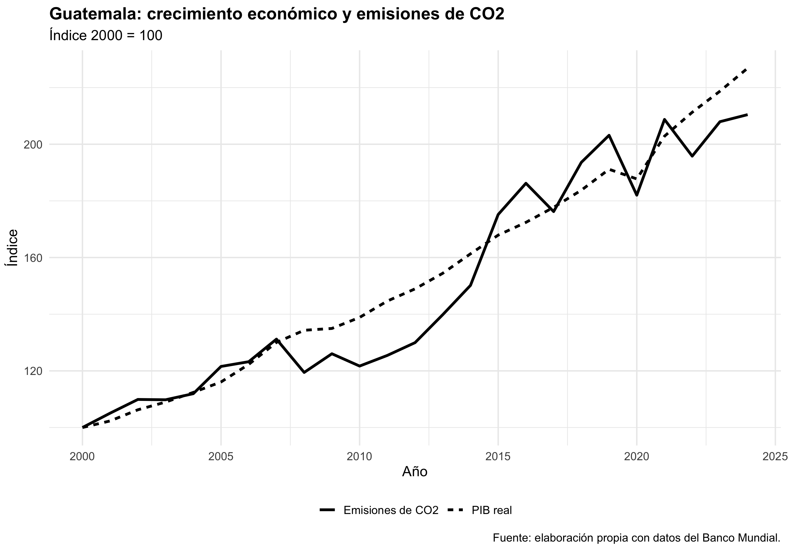
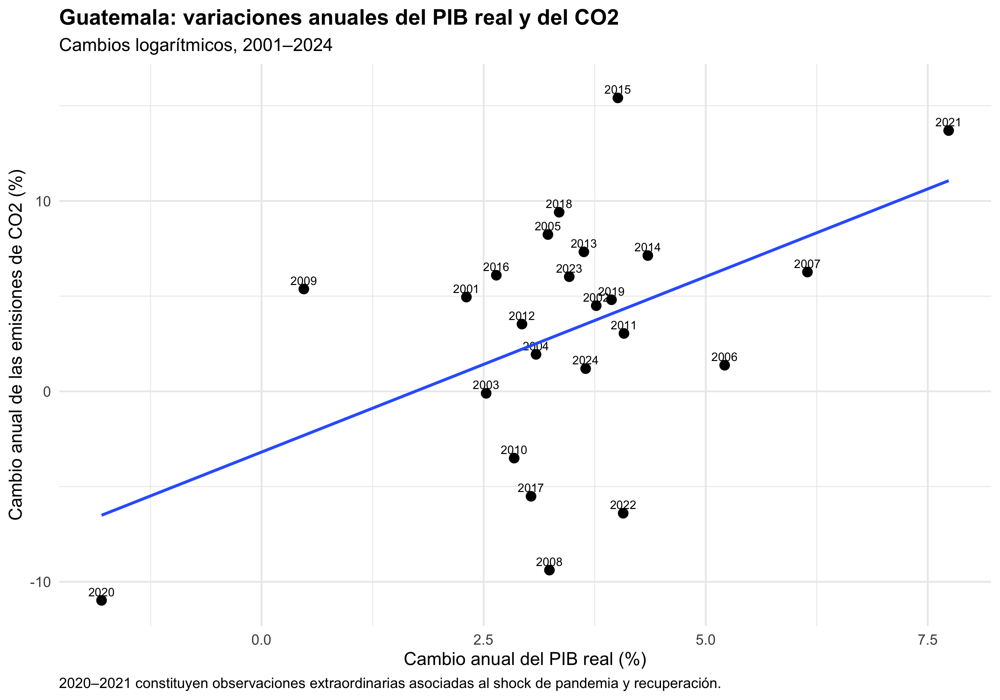
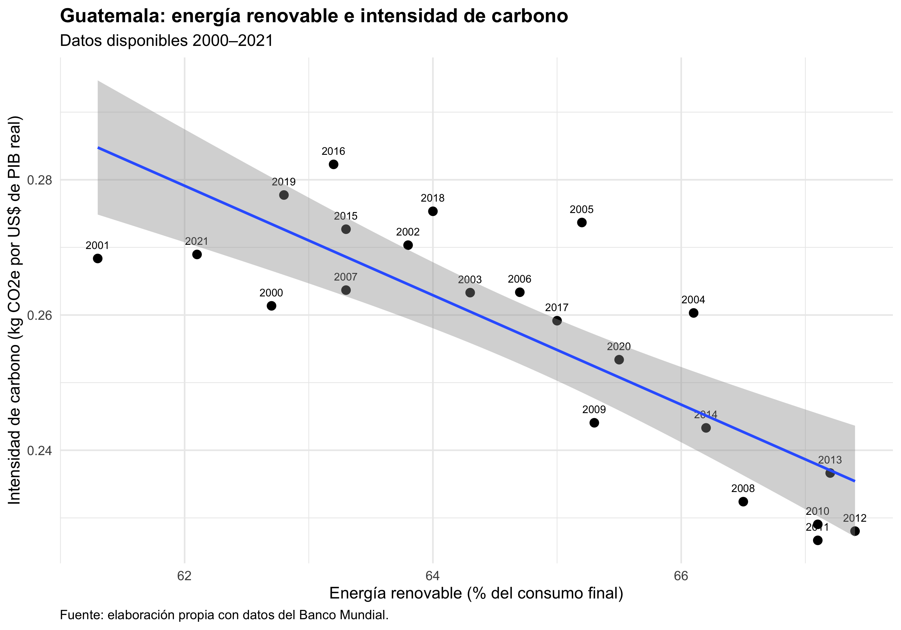
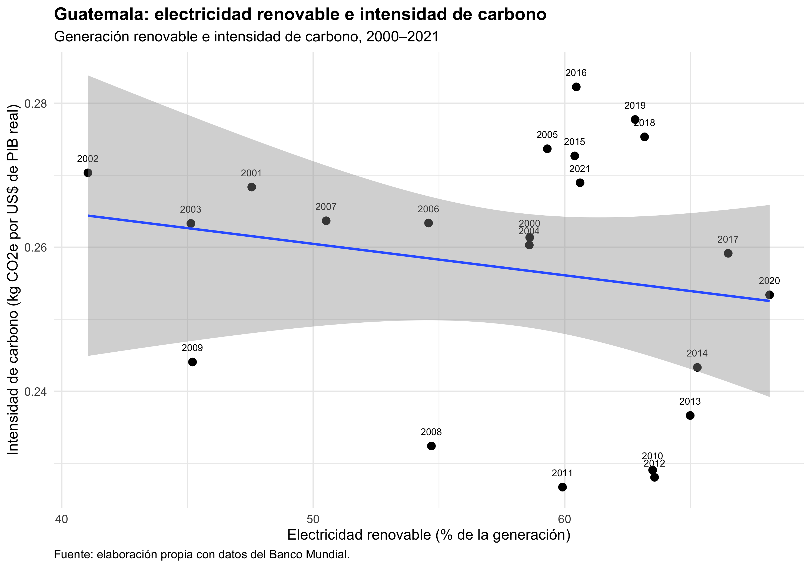

# Guatemala CO₂ Decoupling

## Economic Growth and Carbon Emissions in Guatemala

This Kairos Lab examines the relationship between economic growth and carbon emissions in Guatemala using publicly available data from the World Bank API.

The central question is:

> **Has Guatemala's economic growth become less dependent on carbon emissions?**

The experiment retrieves economic, emissions, and energy indicators programmatically, constructs a reproducible dataset, and generates the figures and summary tables used in the associated Kairos analysis.

---

## 1. Research question

Economic growth has historically been associated with greater energy consumption and environmental pressure.

A relevant question for climate and development policy is whether an economy can increase economic activity without increasing carbon emissions at the same rate.

This experiment examines that question for Guatemala using historical World Bank indicators.

The analysis is descriptive. It does not estimate a causal effect of economic growth on emissions.

---

## 2. Data source

Data are retrieved programmatically from the World Bank API.

The experiment uses publicly available World Bank indicators covering economic activity, carbon emissions, renewable energy, and electricity generation.

The API connection is implemented in:

```text
01_conexion_banco_mundial.R
```

The main analysis is implemented in:

```text
02_analisis_desacoplamiento.R
```

Because the experiment queries a live external API, future executions may reflect revisions made by the World Bank to historical series.

API availability and response times are also outside the control of Kairos. A temporary network or API timeout does not necessarily indicate an error in the experiment. Re-running the analysis may resolve transient availability problems.

---

## 3. Analytical workflow

The experiment follows this general pipeline:

```text
World Bank API
      ↓
Indicator retrieval
      ↓
Data cleaning and merging
      ↓
Guatemala time series
      ↓
Growth and emissions analysis
      ↓
Energy-system indicators
      ↓
Figures and result tables
```

The code separates data retrieval from the main analytical workflow so that the API connection can be inspected independently.

---

## 4. Repository structure

```text
guatemala-co2-decoupling/
├── README.md
├── 01_conexion_banco_mundial.R
├── 02_analisis_desacoplamiento.R
├── figures/
│   ├── 01_pib_emisiones.png
│   ├── 02_variaciones_anuales.png
│   ├── 03_renovables_intensidad.png
│   └── 04_electricidad_renovable.png
└── results/
    ├── cambios_gt.csv
    ├── desacoplamiento_gt.csv
    ├── electricidad_gt.csv
    └── energia_gt.csv
```

---

## 5. Requirements

The experiment was successfully reproduced using:

```text
R 4.6.1
```

Required R packages:

```text
jsonlite
dplyr
tidyr
ggplot2
```

You can verify whether the packages are installed with:

```bash
Rscript -e 'packages <- c("jsonlite","dplyr","tidyr","ggplot2"); print(sapply(packages, requireNamespace, quietly=TRUE))'
```

If necessary, install them in R with:

```r
install.packages(c("jsonlite", "dplyr", "tidyr", "ggplot2"))
```

---

## 6. Reproducing the experiment

Clone Kairos Labs:

```bash
git clone https://github.com/josuetartons-cpu/kairos-labs.git
```

Enter this Lab:

```bash
cd kairos-labs/guatemala-co2-decoupling
```

Run:

```bash
Rscript 02_analisis_desacoplamiento.R
```

The script retrieves the required data from the World Bank API and regenerates the analytical outputs.

A successful execution ends with:

```text
KAIROS — EXPERIMENTO COMPLETADO
```

---

## 7. Expected outputs

The experiment generates four figures:

```text
figures/01_pib_emisiones.png
figures/02_variaciones_anuales.png
figures/03_renovables_intensidad.png
figures/04_electricidad_renovable.png
```

and four result tables:

```text
results/desacoplamiento_gt.csv
results/cambios_gt.csv
results/energia_gt.csv
results/electricidad_gt.csv
```

---

## 8. Figures

### GDP and carbon emissions



### Annual changes



### Renewable energy and carbon intensity



### Renewable electricity



---

## 9. Reproducibility validation

The experiment was independently re-run from the Kairos Labs directory on September 22, 2026.

The code retrieved the data again from the World Bank API and regenerated all four result CSV files.

SHA-256 hashes of the regenerated files were identical to the archived outputs:

```text
79b28c2e84add8b3cd736f4fda04fccc2ccd7f97b056ab94158fbeded752cffe  results/cambios_gt.csv
a3deea74e0992416be3d69e8cbf10d85695d2eba8462e450a5e70a5e1bc09eb6  results/desacoplamiento_gt.csv
d626f16b2b55ce2338d0d6f01bfcc181ce28173243bf6100c277ea02003b4632  results/electricidad_gt.csv
d674deb66b26f90f5b896c49a18990c42c264a88b4f0c8350f69cc304bb0acbe  results/energia_gt.csv
```

This confirms byte-for-byte reproduction of the archived CSV outputs at the time of validation.

Because the underlying World Bank API is live, future data revisions may legitimately cause these hashes to change.

---

## 10. API availability

This Lab depends on the availability of the World Bank API.

During reproducibility testing, one request reached the default 60-second connection timeout. Re-running the same experiment subsequently completed successfully and reproduced all archived CSV outputs exactly.

This illustrates an important distinction:

**computational reproducibility does not guarantee permanent availability of an external data provider.**

Kairos does not control World Bank API uptime, latency, historical revisions, indicator availability, or changes to the external service.

The archived outputs in this repository provide a reference snapshot, while the R scripts provide the reproducible data-retrieval and analytical workflow.

---

## 11. Interpretation

The experiment is designed to examine patterns of economic growth, emissions, carbon intensity, and energy composition in Guatemala.

Observed relationships should not be interpreted automatically as causal relationships.

Changes in emissions intensity can reflect multiple mechanisms, including changes in:

- economic structure;
- energy efficiency;
- electricity generation;
- renewable energy use;
- relative sectoral growth;
- technology;
- external economic conditions.

The experiment provides a reproducible descriptive framework for examining these patterns.

---

## 12. Limitations

This analysis relies on publicly available aggregate indicators.

It does not identify causal mechanisms and does not capture all sources of greenhouse-gas emissions or all dimensions of environmental pressure.

Results also depend on the definitions, coverage, revisions, and availability of the underlying World Bank indicators.

Future revisions to historical data may produce results that differ from the archived September 2026 outputs.

---

## 13. Related Kairos publication

The accessible article and technical note associated with this experiment are part of Proyecto Kairos.

Links will be added after the public website structure is finalized.

---

## License

Code in this Lab is distributed under the license specified at the root of the `kairos-labs` repository.

World Bank data remain subject to the applicable terms and licensing conditions of the original data provider.