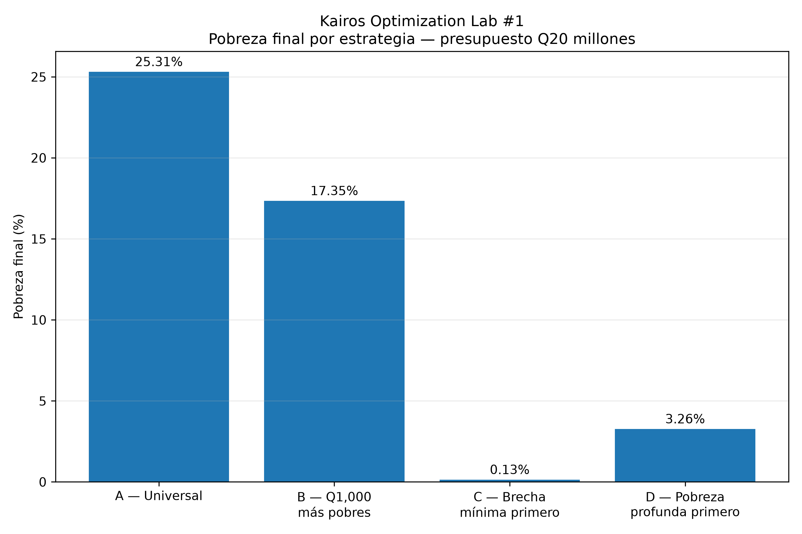
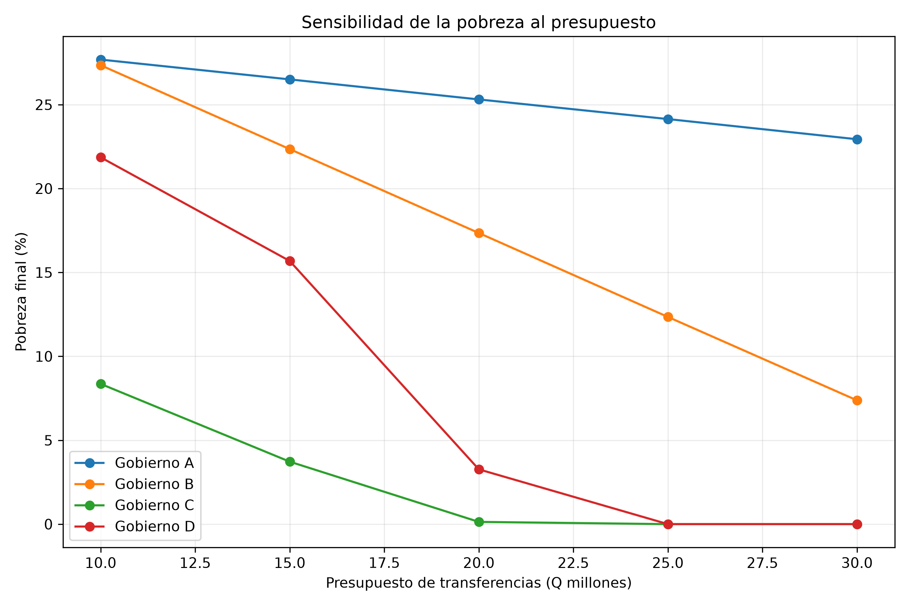
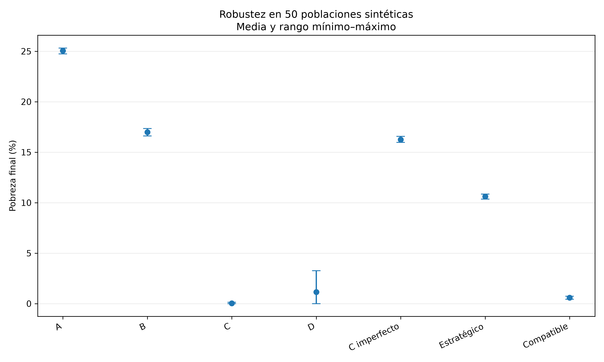
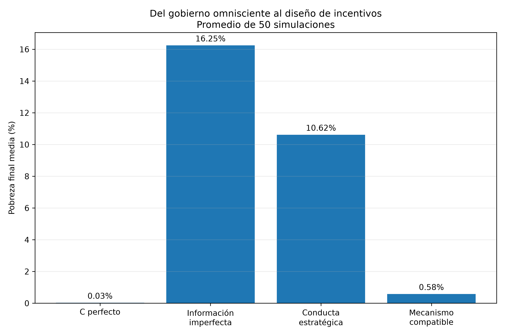

# Kairos Optimization Lab #1

## Targeting Social Transfers Under Limited Information

This experiment studies a simple public-policy problem:

> **Given a fixed social-transfer budget, how much does targeting strategy affect poverty reduction?**

Using a synthetic population of 100,000 households, the experiment compares alternative allocation rules under the same Q20 million budget. It then introduces imperfect information, strategic reporting, incentive-compatible mechanisms, budget sensitivity, and Monte Carlo simulations to examine how targeting performance changes when the government cannot perfectly observe household income.

This is a computational experiment, not an empirical evaluation of an existing social program.

---

## 1. Research question

Governments often face two simultaneous constraints:

1. limited resources;
2. incomplete information about the households they want to assist.

Under a fixed budget, should transfers be distributed broadly, concentrated among poorer households, or tailored to individual poverty gaps?

And what happens when households can misreport information or when income is measured imperfectly?

Kairos Optimization Lab #1 explores these questions in a controlled synthetic environment.

---

## 2. Baseline environment

The experiment generates a synthetic population with the following baseline parameters:

| Parameter | Value |
|---|---:|
| Households | 100,000 |
| Poverty line | Q2,000 |
| Government budget | Q20,000,000 |
| Main random seed | 42 |
| Measurement-error standard deviation | Q500 |
| Measurement-error seed | 123 |

In the generated baseline population:

- **29.97%** of households are below the poverty line.
- The aggregate poverty gap is **Q20,232,300.65**.

Because the population is synthetic and the random seeds are fixed, these baseline results can be reproduced computationally.

---

## 3. Allocation strategies

The experiment compares four baseline government strategies under the same Q20 million budget.

### Government A — Universal transfer

The available budget is distributed broadly across households.

This provides wide coverage but spends resources on households that may not require the transfer to cross the poverty line.

### Government B — Fixed transfer to poorer households

A fixed transfer of **Q1,000** is targeted toward poorer households.

This concentrates resources more heavily than the universal strategy while maintaining a simple transfer rule.

### Government C — Minimum poverty-gap targeting

Transfers are allocated according to the amount required to close household poverty gaps.

Under perfect information, this strategy attempts to use household-level information to minimize unnecessary expenditure.

### Government D — Deepest poverty first

Resources are prioritized toward households experiencing the deepest poverty.

This changes the allocation objective: resources are concentrated on the most deprived households first rather than prioritizing households closest to crossing the poverty line.

---

## 4. Baseline results

With the same Q20 million budget, the four allocation rules produce substantially different outcomes.

| Strategy | Final poverty | Households leaving poverty | Remaining poverty gap |
|---|---:|---:|---:|
| A — Universal | 25.31% | 4,662 | Q14,700,179.40 |
| B — Q1,000 to poorer households | 17.35% | 12,623 | Q4,030,672.00 |
| C — Minimum poverty gap first | 0.13% | 29,837 | Q233,786.52 |
| D — Deepest poverty first | 3.26% | 26,707 | Q232,300.65 |

These results illustrate a central feature of the experiment:

**holding the budget constant does not hold policy performance constant.**

Allocation rules determine which households receive resources, how much they receive, and therefore how effectively a given budget changes measured poverty outcomes.

---

## 5. Imperfect information and strategic behavior

Perfect targeting assumes that the government observes the information required to calculate household needs accurately.

Real targeting systems rarely operate under that assumption.

The experiment therefore extends the baseline model by introducing:

- income measurement error;
- imperfect targeting;
- strategic household reporting;
- incentive-compatible mechanisms.

This allows the experiment to distinguish between the performance of a targeting rule under perfect information and its performance when information itself becomes part of the policy problem.

---

## 6. Monte Carlo analysis

The experiment uses repeated simulations to examine whether the central results depend on a single realization of the synthetic population or information environment.

The main Monte Carlo outputs generated by the current implementation are:

| Scenario | Central poverty result |
|---|---:|
| Perfect-information targeting | 0.03% |
| Imperfect-information targeting | 16.25% |
| Strategic reporting | 10.62% |
| Incentive-compatible mechanism | 0.58% |
| Compatible-mechanism manipulation | 0.00% |

These simulations are intended to test the robustness of the mechanisms within the model. They should not be interpreted as forecasts or estimates for Guatemala or any other real population.

---

## 7. Repository structure

```text
optimization-lab-01/
├── README.md
├── requirements.txt
├── main.py
├── simulation.py
├── policies.py
├── game_theory.py
├── monte_carlo.py
├── final_results.py
├── figures/
│   ├── 01_pobreza_final_gobiernos.png
│   ├── 02_sensibilidad_presupuesto.png
│   ├── 03_monte_carlo_robustez.png
│   └── 04_informacion_incentivos.png
└── results/
    ├── resultados_base.csv
    ├── sensibilidad_presupuesto.csv
    └── resumen_monte_carlo.csv
```

### Main files

`main.py`  
Runs the complete experiment.

`simulation.py`  
Generates the synthetic household population and poverty-related variables.

`policies.py`  
Implements the alternative transfer-allocation strategies.

`game_theory.py`  
Introduces strategic reporting and incentive-related mechanisms.

`monte_carlo.py`  
Runs repeated simulations used for robustness analysis.

`final_results.py`  
Generates the final figures and result files.

---

## 8. Reproducing the experiment

### Requirements

The experiment uses:

- Python
- NumPy
- pandas
- Matplotlib

It has been successfully reproduced in a clean virtual environment using **Python 3.14.6**.

Clone the repository and enter this Lab:

```bash
git clone https://github.com/josuetartons-cpu/kairos-labs.git
cd kairos-labs/optimization-lab-01
```

Create a virtual environment:

```bash
python3 -m venv .venv
```

Activate it on macOS or Linux:

```bash
source .venv/bin/activate
```

Install the required packages:

```bash
pip install -r requirements.txt
```

Run the complete experiment:

```bash
python main.py
```

The script will execute the baseline allocation experiments, information and incentive extensions, Monte Carlo analysis, and final output generation.

Depending on the machine, the Monte Carlo portion may take some time to complete.

---

## 9. Expected outputs

A successful run should finish with:

```text
KAIROS OPTIMIZATION LAB #1 — EXPERIMENTO COMPLETADO
FIN DE LA SIMULACIÓN
```

and generate or update:

```text
figures/01_pobreza_final_gobiernos.png
figures/02_sensibilidad_presupuesto.png
figures/03_monte_carlo_robustez.png
figures/04_informacion_incentivos.png

results/resultados_base.csv
results/sensibilidad_presupuesto.csv
results/resumen_monte_carlo.csv
```

The baseline reproduction should approximately report:

```text
Initial poverty: 29.97%
Initial poverty gap: Q20,232,300.65

A — Final poverty: 25.31%
B — Final poverty: 17.35%
C — Final poverty: 0.13%
D — Final poverty: 3.26%
```

With the fixed seeds and compatible software environment, the generated results should be reproducible.

---

## 10. Figures

### Poverty after alternative allocation strategies



### Budget sensitivity



### Monte Carlo robustness



### Information and incentives



---

## 11. Interpretation

The experiment highlights three different problems that can otherwise be conflated.

**Allocation:** Given accurate information, how should a fixed budget be distributed?

**Information:** What happens when the government does not observe household circumstances perfectly?

**Incentives:** What happens when the targeting mechanism changes households' incentives to report information truthfully?

The large performance differences across scenarios therefore do not imply that one simulated rule can simply be transferred into real policy. Instead, they illustrate how optimization, information quality, and behavioral incentives interact within a controlled model.

---

## 12. Limitations

This experiment is deliberately simplified.

The household population is **synthetic**. It is not a representative sample of Guatemala or another country.

The model does not attempt to capture all features of real social-protection systems, including:

- administrative costs;
- political constraints;
- geographic targeting;
- household behavioral responses beyond the mechanisms modeled here;
- dynamic income changes;
- labor-supply responses;
- implementation capacity;
- exclusion and inclusion errors beyond the modeled information structures;
- general-equilibrium effects.

The numerical results should therefore be interpreted as properties of the simulated environment rather than empirical estimates of real-world policy effects.

The experiment is designed to explore mechanisms and trade-offs, not to prescribe a specific social policy.

---

## 13. Related Kairos publication

An accessible article explaining the intuition, experiment, and main findings is part of the Kairos project.

**Kairos publication:** link will be added after the public website launch.

---

## License

Code in this repository is released under the license specified in the root of `kairos-labs`.

Third-party datasets, when used in future Labs, may be subject to their own licenses and terms of use.